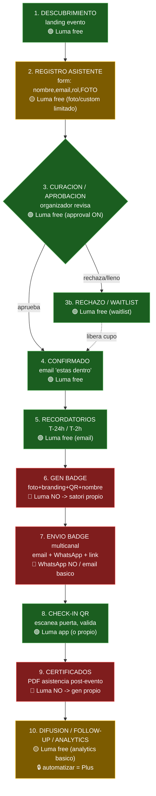

# Customer Journey — Evento 50 invitados (badges + certificados)

> Diagrama editable. Pegá el bloque ` ```mermaid ` en https://mermaid.live
> o https://draw.io (Arrange > Insert > Advanced > Mermaid) para moverlo visual.

## Leyenda
- 🟢 **LUMA free lo cubre**
- 🟡 **LUMA parcial** (lo hace pero limitado/manual)
- 🔴 **LUMA NO** → necesita otra herramienta
- 🔒 **Requiere Luma Plus** (~$59/mes) si querés automatizar vía API

---

## Diagrama (state machine + cobertura Luma)



---

## Frontera Luma (resumen)

| Etapa | Luma free | Necesita otra tool |
|---|---|---|
| 1 Descubrimiento | ✅ | — |
| 2 Registro + foto | ⚠️ básico | form propio si querés foto/branding |
| 3 Curación/aprobación | ✅ | — |
| 3b Rechazo/waitlist | ✅ | — |
| 4 Confirmado | ✅ | — |
| 5 Recordatorios | ✅ | — |
| **6 Badge (foto+QR)** | ❌ | **satori (propio)** |
| **7 Envío multicanal** | ❌ WhatsApp | **Resend + wa.me/Twilio** |
| 8 Check-in QR | ✅ app Luma | propio si querés dashboard custom |
| **9 Certificados PDF** | ❌ | **gen propio (satori/pdf-lib)** |
| 10 Difusión/analytics | ⚠️ básico | 🔒 API (Plus) o tool propia |

**Luma free te cubre 1–5 + 8.** Lo que SÍ o SÍ construyes: **6, 7, 9** (badge, envío WhatsApp, certificados).

---

## Decisión de arquitectura (según presupuesto)

- **Opción $0:** Luma free para 1–5 + 8 → export CSV manual → tu app (Next.js + satori) hace 6,7,9.
  - Contra: CSV manual, sin tiempo-real, sin API.
- **Opción Plus ($59/mes):** API conecta todo, tiempo-real, badge/cert auto al confirmar.
- **Opción sin Luma:** form propio (Tally free webhook) → tu app hace TODO el journey. $0 + tiempo-real, pero construís registro.
