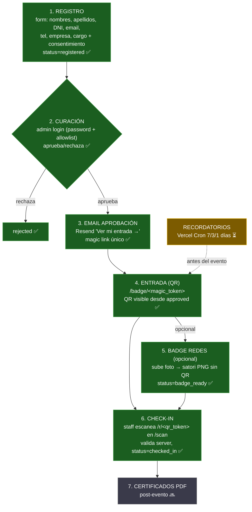

# Customer Journey — Plataforma de Eventos HACK IA

> App propia (Next.js + Supabase). **NO Luma** (ver decisión en `CLAUDE.md`).
> Diagrama editable: pega el bloque ` ```mermaid ` en https://mermaid.live

## Leyenda
- ✅ **Construido y funcionando**
- ⏳ **Pendiente** (en backlog)
- 🔜 **Futuro** (fuera del scope actual)

---

## Diagrama — journey + estado de `status`



---

## Puntos clave del diseño

- **Entrada = QR, no la foto.** El QR de check-in está disponible apenas se
  aprueba al invitado (`status=approved`). La foto es **opcional** y solo mejora
  el badge para compartir en redes. Antes la foto bloqueaba la entrada → guests
  sin foto no tenían QR (gap que resolvió S-A).
- **Un solo link para todo.** El email de aprobación lleva `/badge/<magic_token>`.
  Esa misma página: muestra el QR de entrada, permite subir foto y descargar el
  badge. No hay QR-imagen en el email — el link es la entrada.
- **`magic_token` vs `qr_token`.** El `magic_token` autentica la página
  self-service (sin cuenta). El `qr_token` va dentro del QR y se valida
  server-side en el check-in. Nunca se expone el `guest_id`.
- **Check-in staff-only.** La cámara viva vive en `/scan`, gated por
  `requireAdmin()`. Un invitado que abre `/r/<qr_token>` no ve datos; solo el
  staff logueado dispara la validación.

---

## Tokens y seguridad

| Token | Dónde | Uso | Regla |
|---|---|---|---|
| `magic_token` | email → `/badge/<token>` | página self-service (QR + foto + badge) | uno por invitado, reusado |
| `qr_token` | dentro del QR → `/r/<token>` | check-in staff | ≠ `guest_id`, valida server |

> ⚠️ Compartir `/badge/<magic_token>` en redes filtra el token (deuda #9,
> despriorizada). El badge de descarga va sin QR para mitigar.
