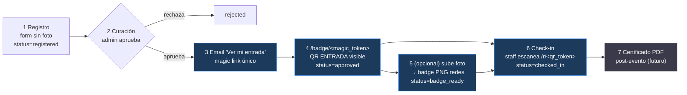
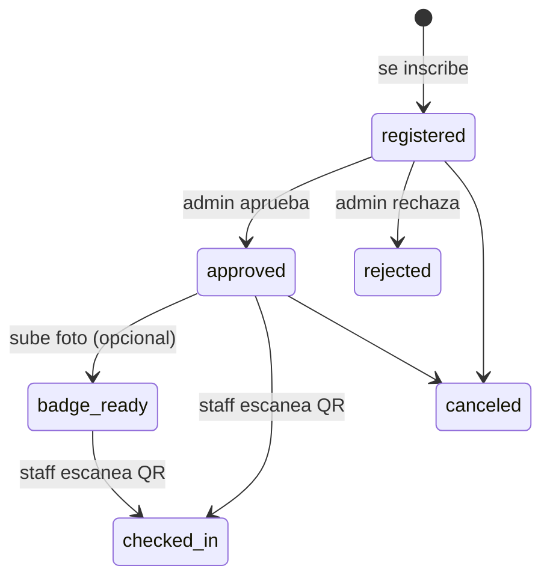

# 🎟️ Customer Journey — Plataforma de Eventos HACK IA

App propia (Next.js + Supabase) para el ciclo del invitado:
**registro → curación → entrada (QR) → badge → check-in → certificado**.

> Decisión de arquitectura: **NO Luma**. App propia sobre Supabase
> (Postgres + Storage + Auth) junta DB, fotos y magic-link gratis.
> Multi-evento desde el día 1 (`event_id` en toda query). Ver `CLAUDE.md`.

---

## 🔀 Flujo del invitado

**Clave del diseño:** la **entrada = el QR**, disponible desde que se aprueba.
El invitado recibe **un solo link** (`/badge/<magic_token>`) que hace todo:
muestra el QR de entrada, permite subir foto (opcional) y descargar el badge
para redes. La foto **no bloquea** el ingreso — solo mejora el badge social.

---

## 🔑 State machine

- **`magic_token`** — un token por invitado. Reusado para el link único
  (QR entrada + subir foto + descargar badge). Nunca expira.
- **`qr_token`** — token aleatorio del QR de entrada. **≠ `guest_id`.**
  El check-in valida server-side en `/r/<qr_token>`.

---

## 🧩 Etapas y estado de construcción

| # | Etapa | Ruta / mecanismo | Estado |
|---|---|---|---|
| 1 | Registro | `/` form (nombres, apellidos, DNI, email, tel, empresa, cargo) + consentimiento Ley 29733 | ✅ |
| 2 | Curación | `/admin` login password compartida + allowlist (`ADMIN_EMAILS`) | ✅ |
| 3 | Email aprobación | Resend — "Ver mi entrada →" con magic link | ✅ |
| 4 | **Entrada (QR)** | `/badge/<magic_token>` — QR desde `approved` | ✅ |
| 5 | Badge foto+redes | subir foto opcional → satori PNG (descarga sin QR) | ✅ |
| 6 | Check-in staff | `/scan` (gated) escanea `/r/<qr_token>`, valida server | ✅ |
| 7 | Recordatorios | Vercel Cron 7/3/1 días o fechas fijas | ⏳ pendiente (#24) |
| 8 | Certificados PDF | pdf-lib post-evento | 🔜 futuro |

---

## 🔒 Reglas de dominio (no romper)

- **Multi-evento:** toda query de guests filtra por `event_id`. Nunca global.
- **`qr_token` ≠ `guest_id`:** el QR lleva token aleatorio; check-in valida server.
- **Check-in staff-only:** cámara viva en `/scan` gated por `requireAdmin()`.
  Un no-staff que abre `/r/<qr_token>` no ve nada; el staff logueado valida.
- **NUNCA borrar `guests` tras mandar mails reales** — el link del mail lleva el
  `magic_token`; borrar el guest deja el link muerto (404). Ver `CLAUDE.md`.
- **Ponentes/speakers = OUT OF SCOPE.**

---

## 📂 Docs del proyecto
- [`CLAUDE.md`](./CLAUDE.md) — guía técnica, stack, convenciones, DoD
- [`JOURNEY.md`](./JOURNEY.md) — state machine detallada
- [`RESEARCH.md`](./RESEARCH.md) — repos, costos, jerga
- [`docs/prds/PRD-event-platform.md`](./docs/prds/PRD-event-platform.md) — PRD
