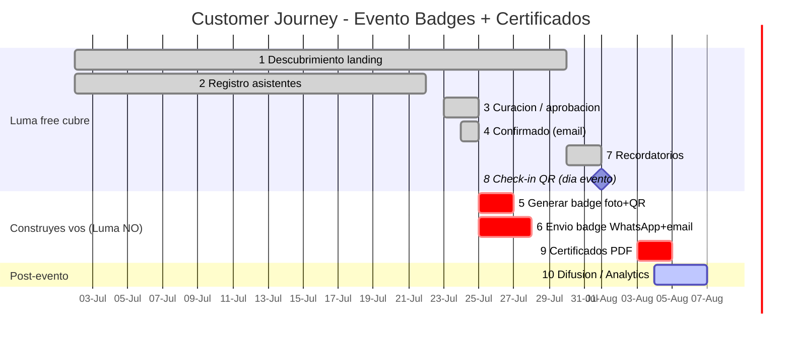
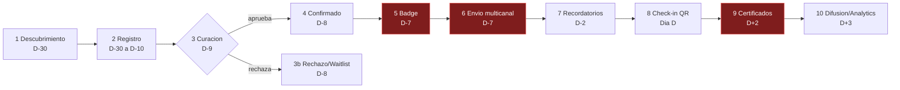

# Customer Journey — Timeline Evento (50 invitados)

> Este gráfico se dibuja solo en **GitHub**, **mermaid.live**, **Notion**, **VS Code** (extensión Mermaid).
> Día del evento = **D (2026-08-01, ejemplo)**. Cambiá las fechas y se reacomoda.
> 🔴 Tareas en rojo (`crit`) = Luma NO lo hace, lo construís vos.

## Timeline (gantt)



## Mismo journey como flujo (flowchart)



## Cómo verlo como gráfico (sin tocar nada)

1. **mermaid.live** — pegás el bloque ` ```mermaid ` → lo ves al toque, exportás PNG/SVG.
2. **GitHub** — subís este .md a un repo → se dibuja solo al abrirlo.
3. **VS Code** — instalá extensión "Markdown Preview Mermaid Support" → preview.
4. **Notion** — bloque `/code` lenguaje Mermaid → pegás.
